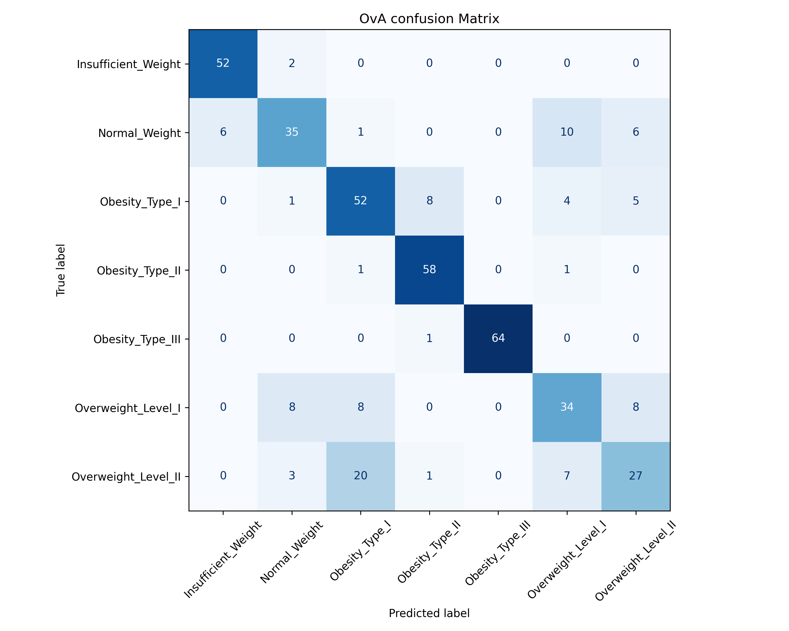
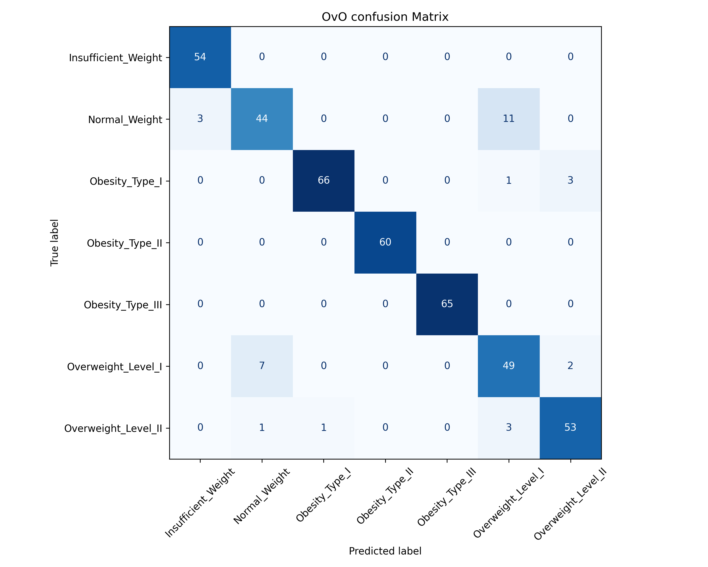

# Multiclass Obesity Classification Using Logistic Regression

### Project 04 | The AI Engineering Journey

A machine learning project that classifies individuals into seven weight-status categories using demographic, dietary, and lifestyle features. The project explores two strategies for extending binary logistic regression to multiclass classification: **One-vs-All (OvA)** and **One-vs-One (OvO)**.

Both strategies are trained and evaluated on the same stratified train-test split to compare their performance.

## Results at a Glance

| Metric | One-vs-All | One-vs-One |
|---|---:|---:|
| Binary classifiers | 7 | 21 |
| Test accuracy | 76.12% | 92.43% |
| Correct predictions | 322 / 423 | 391 / 423 |
| Macro F1-score | 0.75 | 0.92 |
| Weighted F1-score | 0.76 | 0.92 |

**Key observation:** OvO achieved 16.31 percentage points higher accuracy than OvA on this test split. This is an experimental result for the chosen dataset and configuration, not a claim that OvO is universally superior.

---

## 1. Project Overview

Logistic regression is fundamentally a binary classification algorithm. When a dataset contains more than two target classes, strategies such as One-vs-All and One-vs-One allow us to construct multiclass classifiers from multiple binary models.

This project investigates how these two strategies perform when predicting seven weight-status categories.

**Objectives**

- Prepare a dataset containing numerical and categorical features.
- Apply standardization and one-hot encoding.
- Prevent preprocessing-related data leakage.
- Train multiclass logistic regression using OvA and OvO.
- Compare accuracy, precision, recall, and F1-score.
- Visualize classification errors using confusion matrices.

## 2. Dataset

The project uses the **Estimation of Obesity Levels Based on Eating Habits and Physical Condition** dataset from the UCI Machine Learning Repository.

Dataset source: [UCI Machine Learning Repository](https://archive.ics.uci.edu/dataset/544/estimation+of+obesity+levels+based+on+eating+habits+and+physical+condition)

The dataset may have a different filename depending on the download source. Rename the downloaded CSV to Obesity_level_predictiion_dataset.csv and place it inside datasets/obesity/


| Property | Value |
|---|---|
| Samples | 2,111 |
| Total columns | 17 |
| Input features | 16 |
| Target | `NObeyesdad` |
| Target classes | 7 |
| Training samples | 1,688 |
| Testing samples | 423 |
| Features after preprocessing | 23 |

The dataset includes demographic characteristics, physical measurements, eating habits, and lifestyle-related attributes.

### Target Classes

1. `Insufficient_Weight`
2. `Normal_Weight`
3. `Obesity_Type_I`
4. `Obesity_Type_II`
5. `Obesity_Type_III`
6. `Overweight_Level_I`
7. `Overweight_Level_II`

These categories are encoded as integers for model training. Their original names are preserved for labeling the confusion matrices.

### Input Features

The input features include:

| Feature | Description |
|---|---|
| `Gender` | Gender |
| `Age` | Age |
| `Height` | Height |
| `Weight` | Weight |
| `family_history_with_overweight` | Family history of overweight |
| `FAVC` | Frequent consumption of high-calorie food |
| `FCVC` | Frequency of vegetable consumption |
| `NCP` | Number of main meals |
| `CAEC` | Food consumption between meals |
| `SMOKE` | Smoking |
| `CH2O` | Daily water consumption |
| `SCC` | Calorie consumption monitoring |
| `FAF` | Physical activity frequency |
| `TUE` | Time using technology devices |
| `CALC` | Alcohol consumption |
| `MTRANS` | Transportation method |

## 3. Methodology

### Step 1: Data Loading

The CSV dataset is loaded using Pandas. Input features are separated from the target variable, `NObeyesdad`.

### Step 2: Train-Test Split

The dataset is divided into:

- 80% training data
- 20% testing data

A fixed random seed (`random_state=42`) supports reproducibility.

Stratification preserves approximately the same distribution of obesity classes in both subsets.

### Step 3: Preprocessing

A scikit-learn `ColumnTransformer` applies separate transformations to numerical and categorical columns.

**Numerical features**

Numerical columns are standardized using `StandardScaler`:

$$
z = \frac{x-\mu}{\sigma}
$$

Here, the mean and standard deviation are learned from the training set.

**Categorical features**

Categorical columns are processed using `OneHotEncoder`, with the first category dropped for each feature.

Unknown categories are ignored during transformation, and dense arrays are generated.

The preprocessing transformer is fitted only on the training data. The same learned transformations are then applied to the test data to prevent preprocessing-related data leakage.

After preprocessing, each sample contains **23 numerical features**.

## 4. Multiclass Classification

### Logistic Regression

Logistic regression models the relationship between input features and a binary target using the sigmoid function:

$$
P(y=1 \mid X) = \frac{1}{1+e^{-(w^T X+b)}}
$$

Since this project contains seven target classes, two multiclass strategies are implemented.

### One-vs-All (OvA)

One-vs-All, also called One-vs-Rest, trains one binary classifier for each target category.

Each classifier distinguishes one category from all remaining categories combined.

For seven classes:

$$
N_{\mathrm{OvA}} = 7
$$

The project uses scikit-learn's `OneVsRestClassifier` with logistic regression as the underlying estimator.

### One-vs-One (OvO)

One-vs-One trains a separate binary classifier for every possible pair of target categories.

For seven classes:

$$
N_{\mathrm{OvO}} = \frac{7(7-1)}{2} = 21
$$

The project uses scikit-learn's `OneVsOneClassifier` with logistic regression as the underlying estimator.

Both strategies use `LogisticRegression(max_iter=1000)`.

## 5. Model Evaluation

The models are evaluated using the same 423 test samples.

The evaluation includes:

- Accuracy
- Per-class precision
- Per-class recall
- Per-class F1-score
- Macro and weighted averages
- Confusion matrices

### Accuracy Comparison

| Metric | OvA | OvO |
|---|---:|---:|
| Accuracy | 0.7612 | 0.9243 |
| Macro precision | 0.76 | 0.92 |
| Macro recall | 0.76 | 0.92 |
| Macro F1-score | 0.75 | 0.92 |
| Weighted F1-score | 0.76 | 0.92 |

OvA correctly classified 322 of the 423 test samples, while OvO correctly classified 391.

### One-vs-All Confusion Matrix



OvA classified 64 of 65 `Obesity_Type_III` samples correctly.

Its most noticeable classification error involved `Overweight_Level_II`: 20 samples from this category were predicted as `Obesity_Type_I`.

### One-vs-One Confusion Matrix



OvO correctly classified all test samples belonging to `Insufficient_Weight`, `Obesity_Type_II`, and `Obesity_Type_III`.

Its largest remaining confusion involved `Normal_Weight` and `Overweight_Level_I`: 11 Normal Weight samples were predicted as Overweight Level I.

### Interpretation

On this particular train-test split, OvO produced substantially fewer classification errors than OvA.

OvO's pairwise classifiers only need to distinguish two classes at a time, whereas each OvA classifier must distinguish one class from all remaining classes.

The results illustrate how the choice of multiclass strategy can affect logistic regression performance.

## 6. Project Structure

```text
04-Multi-Class-Classification/
│
├── src/
│   ├── __init__.py
│   ├── config.py
│   ├── data_loader.py
│   ├── preprocessing.py
│   ├── trainer.py
│   ├── evaluator.py
│   └── visualizer.py
│
├── outputs/
│   ├── ova_confusion_matrix.png
│   └── ovo_confusion_matrix.png
│
├── main.py
├── requirements.txt
├── .gitignore
└── README.md
```

**Module responsibilities**

- `config.py`: Dataset path, target column, and output directory.
- `data_loader.py`: Loads and previews the dataset.
- `preprocessing.py`: Splits the dataset and transforms numerical and categorical features.
- `trainer.py`: Trains OvA and OvO logistic regression classifiers.
- `evaluator.py`: Generates predictions and evaluation metrics.
- `visualizer.py`: Creates and saves confusion matrix heatmaps.
- `main.py`: Coordinates the complete workflow.

## 7. Installation and Usage

### Prerequisites

- Python 3.10 or later
- Git
- The obesity dataset

### Clone the Repository

```bash
git clone https://github.com/ayushman652/Multiclass-Obesity-Classification
```

The URL above assumes the repository is published under that name. Replace it with the actual repository URL if you choose a different name.

### Install Dependencies

```bash
pip install -r requirements.txt
```

### Download the Dataset

Download the CSV from the UCI dataset page linked above.

The project expects the following workspace structure:

```text
AI-Engineering-workspace/
│
├── datasets/
│   └── obesity/
│       └── Obesity_level_predictiion_dataset.csv
│
└── 04-Multi-Class-Classification/
    ├── src/
    ├── outputs/
    └── main.py
```

Ensure the filename matches the path defined in `src/config.py`.

### Run the Project

From inside the project directory:

```bash
python main.py
```

The program loads the dataset, preprocesses the features, trains both multiclass classifiers, prints evaluation reports, and generates two confusion matrix images.

## 8. Limitations and Future Improvements

- **Single split:** The reported metrics come from one stratified train-test split. Repeated stratified cross-validation would provide a more reliable estimate of model performance.
- **Model scope:** Only logistic regression is evaluated. Other classifiers could be explored in future experiments.
- **Dataset limitations:** Performance on this dataset does not establish how accurately the models would generalize to other populations or data sources.
- **Preprocessing:** The current workflow assumes the required feature columns are present and does not implement missing-value imputation.
- **Medical use:** This is an educational machine learning project, not a validated medical diagnostic system.

Potential extensions include hyperparameter tuning, cross-validation, feature importance analysis, and comparisons with other classification algorithms.

## 9. Technologies Used

- Python
- NumPy
- Pandas
- scikit-learn
- Matplotlib

---

## Author

**Ayushman Singh**

B.Tech, Computer Science & Engineering

[GitHub](https://github.com/ayushman652)

*Project 04 of The AI Engineering Journey.*